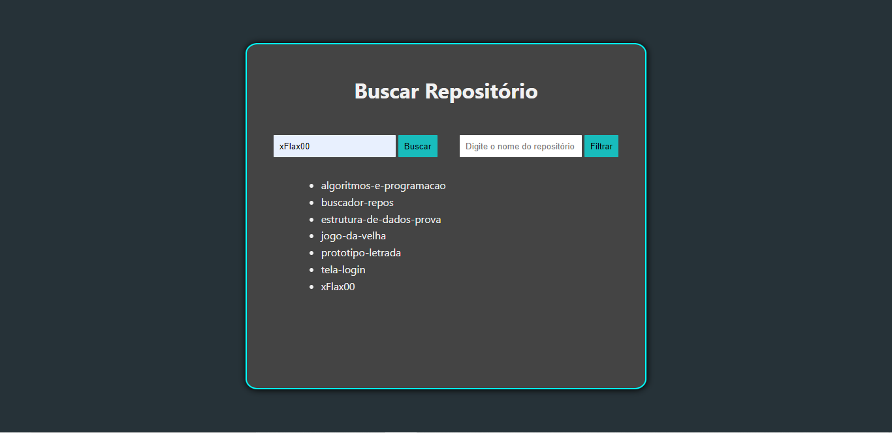

# Buscador de repositório
> Você pode pesquisar repositórios github e filtrar sua pesquisa.

## Sobre o projeto
Esse é um buscador de repositórios github desenvolvido com a biblioteca ReactJS e utiliza a API do github como fonte de dados.

 

## Instruções

1 - Baixe o repositório:
```
git clone https://github.com/xFlax00/buscador-repos.git
```
2 - Acesse o diretório:
```
cd .\buscador-repos\
```

3 - Execute uma atualização dos pacotes:
```
npm install
```

3 - Execute o app:
```
npm start
```